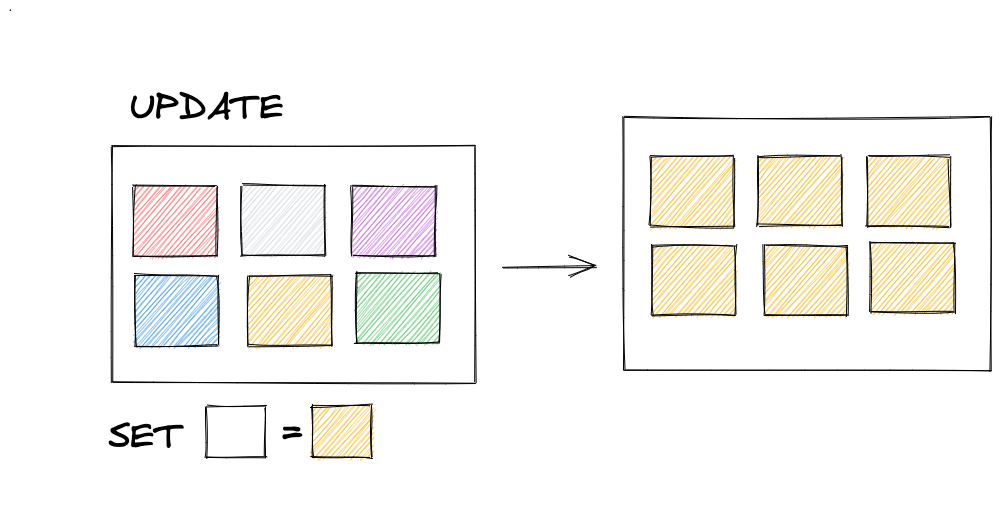

### 2. Introdução à SQL


<small>Back-end: 2.4: Manipulando Tabelas</small>

---

### Foco de hoje

- INSERT
- UPDATE
- DELETE

---

### Tópico 1

Inserindo Dados

---

### O que inserir?

```sql
 DESCRIBE <nome da tabela>;
```

---

### INSERT


---

### Duplicados?

---

### Logs

```sql
    SHOW WARNINGS;
```

---

### O Auto Increment

---

### Como inserir mais de um valor ao mesmo tempo?

---

### Erros?


---

### INSERT IGNORE


---

### Copiando dados para outras tabelas

Qual motivação disso?

---

### Sintaxe

```sql
INSERT INTO sakila.actor (first_name, last_name)
SELECT first_name, last_name FROM sakila.customer LIMIT 5;
```

```sql
SELECT * FROM sakila.actor ORDER BY actor_id DESC;
```

---

### Tópico 2

Atualizando dados



---

### SERÁ QUE FUNCIONA?

```sql
UPDATE sakila.actor SET actor.last_name = 'BENNING';
```

---

### SAFE UPDATE MODE

---

### Como desativar

```sql
    SET SQL_SAFE_UPDATES = 0;
```

---

### Prêmio Update sem Where


---

### UPDATE COM WHERE


---

### COMO FAZER UPDATE
 
~~SEM PERDER O EMPREGO?~~ Do modo certo

```mysql
UPDATE
    sakila.actor 
SET 
    actor.last_name = 'BENNING'
WHERE
    actor.last_name = 'BENING';
```

---

### DB sakila


> Queremos aumentar em 1 dia o tempo de devolução dos 15 filmes mais longos


---

### Verificando a tabela

```sql
SELECT title, rental_duration, length, last_update 
FROM sakila.film 
ORDER BY length DESC 
LIMIT 20; -- Mostre mais registros dos que foram atualizados
```

---

### Resposta:

```sql
UPDATE sakila.film
SET rental_duration = rental_duration + 1 -- Aumenta em 1 dia o tempo para devolução
ORDER BY length DESC -- Ordena os resultados pelo filme de maior duração
LIMIT 15 -- Limita os primeiros resultados
```

---

### Mais alguns cenários

> Estamos em semana de promoção em nossa locadora e queremos aplicar 30% de desconto em filmes específicos

<small> Ids: 609, 612, 622, 626, 650, 653</small>

---

### Tópico 3

Excluíndo dados


---

### DELETE Lógico

---

### Exemplo

```sql
UPDATE sakila.customer
SET active = 0 -- Colocar o valor zero (false) na coluna active
WHERE customer_id = 1; -- O identificador do cliente em questão
```

---

### UM DELETE EXEMPLAR

```mysql
DELETE FROM
    sakila.actor 
WHERE
    actor.last_name = 'BENNING';
```

---

### O QUE DEU ERRADO?

```mysql
SHOW WARNINGS;
```

---

### Por quê?

---

```sql
ON DELETE RESTRICT | NO ACTION
ON DELETE SET NULL
ON DELETE CASCADE
```

---

### Onde encontro isso?

- __Table Inspector__
- [DER](https://trifulcas.com/wp-content/uploads/2018/03/sakila-er.png)

---

### VAMOS REMOVER AS REFERÊNCIAS

```mysql
DELETE FROM
    sakila.film_actor
WHERE
    actor_id IN (124, 174);
```

---

### AGORA VAI

```mysql
DELETE FROM
    sakila.actor 
WHERE
    actor.last_name = 'BENNING';
```

---

### Não seja um leitor deste livro!


---


---

### TRUNCATE vs. DELETE

---

### E o CTRL + Z ?

---

### Dúvidas?


